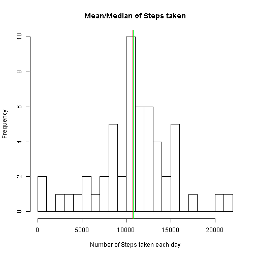
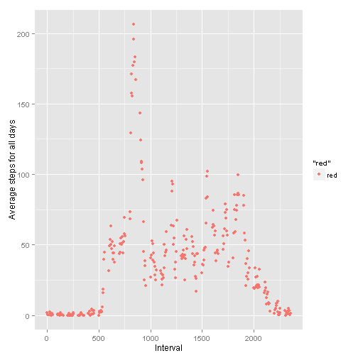
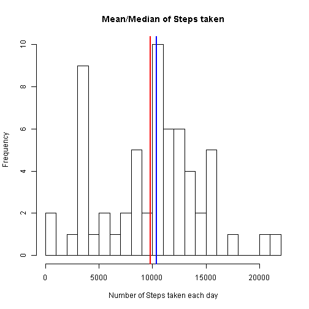
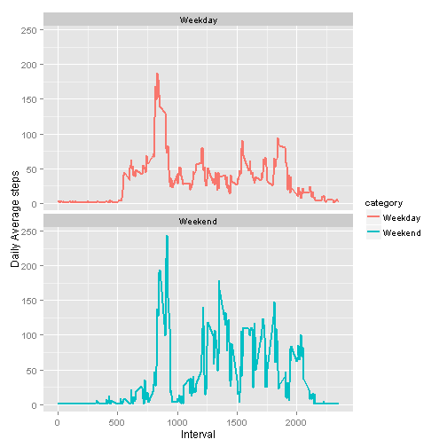

<b>Loading and preprocessing the data </b>

```r
df<-read.csv("./repdata-data-activity/activity.csv")

# Ignore NA cases, consider only complete cases
df<- df[complete.cases(df),]
```

<b>PART 1 --- What is mean total number of steps taken per day?</b>


```r
# Sum up the steps taken for each day
agg.df<-aggregate(df$steps, by=list(df$date),FUN = sum)
```

Histogram represents the frequncy count of steps taken each day. 
For e.g. there are more days where steps taken are between 10000 and 150000 comared to the days where steps taken are more than 15000

```r
hist(agg.df$x,breaks = 30 ,xlab="Number of Steps taken each day" ,main="Mean/Median of Steps taken")

mean(agg.df$x)
```

```
## [1] 10766.19
```

```r
abline(v=mean(agg.df$x),col="red",lwd=2)

median(agg.df$x)
```

```
## [1] 10765
```

```r
abline(v=median(agg.df$x),col="green",lwd=0.5)
```

 


As you can see mean and median have almost the same value so it is hard to distinguish them in the histogram as one colored line overwrites another.


<b>PART 2 ---  What is the average daily activity pattern?</b>


```r
df<-read.csv("./repdata-data-activity/activity.csv")
# Ignore NA cases
df<- df[complete.cases(df),]

# Average steps for all days
avg.steps<-mean(df$steps)

# following function aggregates the total number of steps taken for each interval for all days
agg.df<-aggregate(df$steps, by=list(df$interval),FUN = mean)

# So first data point indicates average number of steps taken for all days for first 
# interval on x axis

library(ggplot2)
qplot(agg.df$Group.1,agg.df$x, type="l",col="red" ,xlab="Interval" , ylab="Average steps for all days")
```

 

From above trend and data set, we can see that average number steps (averaged over all days) are maximum for the interval 835-840.


<b>PART 3 --- Imputing missing values</b>


```r
df<-read.csv("./repdata-data-activity/activity.csv")
dim(df)
```

```
## [1] 17568     3
```

```r
# There are total 2304 records with NA values
sum(is.na(df))
```

```
## [1] 2304
```

```r
# The strategy I am using to fill in the NA values is aggregating the mean for all intervals grouped by each date

x<-aggregate(df$interval, by=list(df$date),FUN = mean)

# rename the data frame column for easier use
names(x)[names(x)=="Group.1"] <- "date"

# Now merge the original data frame with aggregated data frame based on date
df<-merge(df,x,by="date")

rowcount<-nrow(df)

# Loop through all the roecords of data frame df and search for NA values for variable steps, when it finds NA , replace the NA with aggregated interval value for the corrosponding date 
for (i in 1:rowcount)
{
  if(is.na(df[i,]$steps)==TRUE)
  {
    df[i,]$steps<-df[i,]$x/100
  }
  
  
}

# Clean up the data frame to remove unneccesary columns
df$x<-NULL

#Now we have the data frame df with missing data filled in, so lets aggregate the steps per day
agg.df<-aggregate(df$steps, by=list(df$date),FUN = sum)

# Plot the histogram of 30 bars to see the trend in average steps per day
hist(agg.df$x,breaks = 30 ,xlab="Number of Steps taken each day" ,main="Mean/Median of Steps taken")

# Add mean and median to histogram
mean(agg.df$x)
```

```
## [1] 9798.977
```

```r
# Mean is 9798.977
abline(v=mean(agg.df$x),col="red",lwd=2)

median(agg.df$x)
```

```
## [1] 10395
```

```r
# Median is 10395, this is the central value of steps when sorted ascending

abline(v=median(agg.df$x),col="blue",lwd=2)
```

 


So after filling in the NA values, we are able to clearly distinguish mean and median of the data, so here mean indicates the data point where majority population is centerted around, i.e. the frequancy at which maximun steps are taken. Median here indicates the middle score for the set of data points i.e. middle value for the number of steps taken.
Mean and median here are not same unlike part 1 of this assignment because we are shifting the median of data points by filling in NA values.


<b> PART 4 --- Are there differences in activity patterns between weekdays and weekends? </b>


```r
dim(df)
```

```
## [1] 17568     3
```

```r
# Apply the weekdays function to add which day of week it is
df$day<-weekdays(as.Date(df$date))

# If else constrcut to decide weekday or weekend, If day is Staurday or Sunday then weekend else weekday
df$category<-ifelse(df$day %in% c("Saturday","sunday"), "Weekend", "Weekday")

# Aggregate the average number of steps taken by interval and weekday/weekend category
agg.df<-aggregate(df$steps, by=list(df$interval,df$category),FUN = mean)

# Rename the columns for easier manipulations.
names(agg.df)[names(agg.df)=="Group.1"] <- "interval"
names(agg.df)[names(agg.df)=="x"] <- "steps"
names(agg.df)[names(agg.df)=="Group.2"] <- "category"

# Plot the graph for weekdays and weekends to analyse the trend change in average number of steps taken
p<-ggplot(agg.df, aes(x=interval, y=steps, colour=category)) + geom_line(size=0.75) + facet_wrap(~ category, ncol=1) + labs(x="Interval" , y="Daily Average steps")

print(p)
```

 

As you can interpret from these two trends is overall number of steps taken on weekends are gretaer than weekdays. Even the max number of steps for weekend is more than max trend observed for weekday. it concludes that people are more active on weekends than weekdays.
